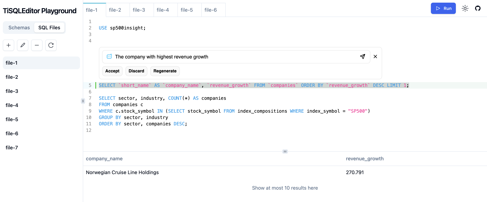
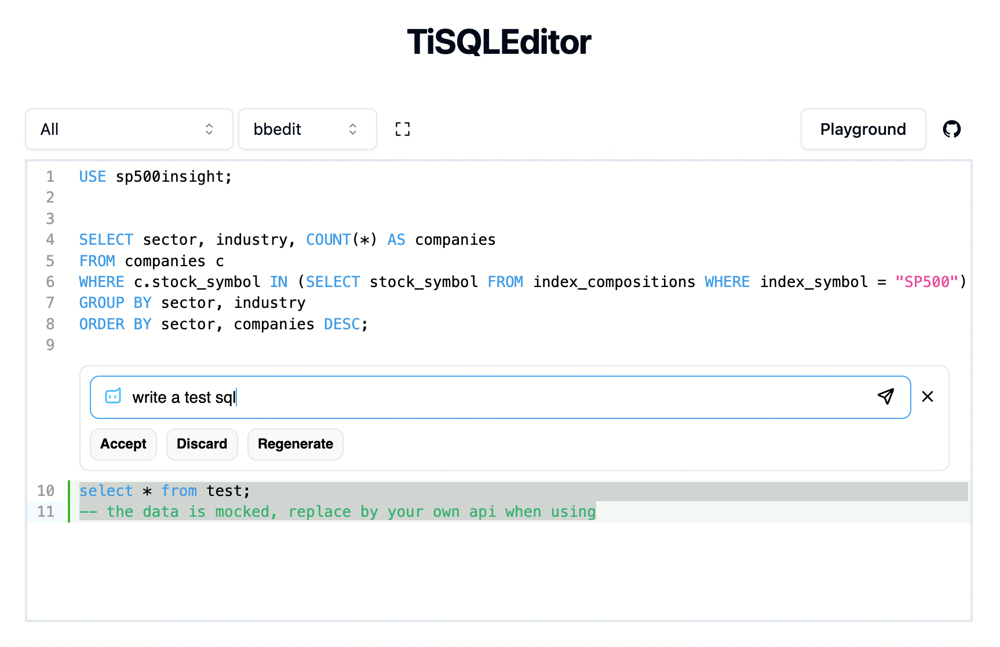

# TiSQLEditor

TiSQLEditor is a CodeMirror6 based SQL code editor which is used in TiDB Cloud Console.

- [Try Full Featured Playground](https://tisqleditor-playground.netlify.app/)



https://github.com/tidbcloud/tisqleditor/assets/1284531/732b600f-5b4e-45d3-a3d2-26479bd59d11

- [Try Simple Example](https://tisqleditor-playground.netlify.app/?example=all&with_select)



## Features

- Support edit multiple SQL files
- Supply React component (Vue component wip)
- Out of box extensions
- AI Widget to chat with AI to help write or refine SQL

## Packages

| package                                          | desc                                                                      |
| ------------------------------------------------ | ------------------------------------------------------------------------- |
| @tidbcloud/tisqleditor                           | SQLEditorInstance with pre-configured extensions                          |
| @tidbcloud/tisqleditor-react                     | React component wrapper                                                   |
| @tidbcloud/codemirror-extension-ai-widget        | a widget to chat with AI to help write or refine SQL                      |
| @tidbcloud/codemirror-extension-sql-parser       | parse the editor content to SQL statements                                |
| @tidbcloud/codemirror-extension-cur-sql          | get the selected SQL statements                                           |
| @tidbcloud/codemirror-extension-cur-sql-gutter   | show gutter for the selected SQL statements                               |
| @tidbcloud/codemirror-extension-sql-autocomplete | SQL keyword and database schema autocomplete                              |
| @tidbcloud/codemirror-extension-linters          | use db statement, full width chars, and regular expression linters        |
| @tidbcloud/codemirror-extension-save-helper      | save the editor content if it changes                                     |
| @tidbcloud/codemirror-extension-events           | 2 normal kinds of event listener: doc change, selection change            |
| @tidbcloud/codemirror-extension-themes           | 2 simple builtin themes, `bbedit` for light mode, `oneDark` for dark mode |
| @tidbcloud/codemirror-extension-basic-setup      | basic configuration for codemirror                                        |

## Usage

See [editor.tsx](./packages/playground/src/components/biz/editor-panel/editor.tsx) or [editor-example.tsx](./packages/playground/src/examples/editor-example.tsx) to get more details.

```shell
pnpm add @tidbcloud/tisqleditor-react @tidbcloud/codemirror-extension-themes @tidbcloud/codemirror-extension-cur-sql-gutter
```

```tsx
import { SQLEditor } from '@tidbcloud/tisqleditor-react'
import { oneDark } from '@tidbcloud/codemirror-extension-themes'
import { curSqlGutter } from '@tidbcloud/codemirror-extension-cur-sql-gutter'

export function Editor() {
  return (
    <SQLEditor
      editorId="MySQLEditor"
      doc={'sele'}
      theme={oneDark}
      basicSetupOptions={{
        autocompletion: true
      }}
      extraExts={[
        curSqlGutter()
        // here you can add some other extensions as you need
      ]}
    />
  )
}
```

## Documentation

// TODO: add documentation link from https://tidbcloud-uikit.netlify.app/

## Development

### Setup

- node.js >18.16.0
- [enable corepack](https://www.totaltypescript.com/how-to-use-corepack): `corepack enable && corepack enable npm`

### Local Development

- `echo 'link-workspace-packages=true' >> ~/.npmrc`
- `pnpm i`
- `pnpm dev`

### Production Build

- `pnpm i`
- `pnpm build`

### PR Commit Convention

Before you create a pull request, please check whether your commits comply with the commit conventions used in this repository. When you create a commit, you should follow the convention `category(scope or module): message` in your commit message while using one of the following categories:

- feat/feature: all changes that introduce completely new code or new features
- fix: changes that fix a bug (ideally you will additionally reference an issue if present)
- refactor: any code related change that is not a fix nor a feature
- chore: all changes to the repository that do not fit into any of the above categories

### Test

To run the test, execute the command `pnpm test`

### Release

- Checkout from the latest main branch.
- Run `pnpm changeset` and follow the instructions, you will need to tell it the version and changelogs.
- Commit the generated changeset file (a markdown file in `.changeset` folder), create a pull request to main branch.
- After your pull request is merged, a new pull request will be created by a bot, you can review your release there.
- After that pull request is merged, a new release will be published automatically to github registry.

## License

[MIT License](./LICENSE)
